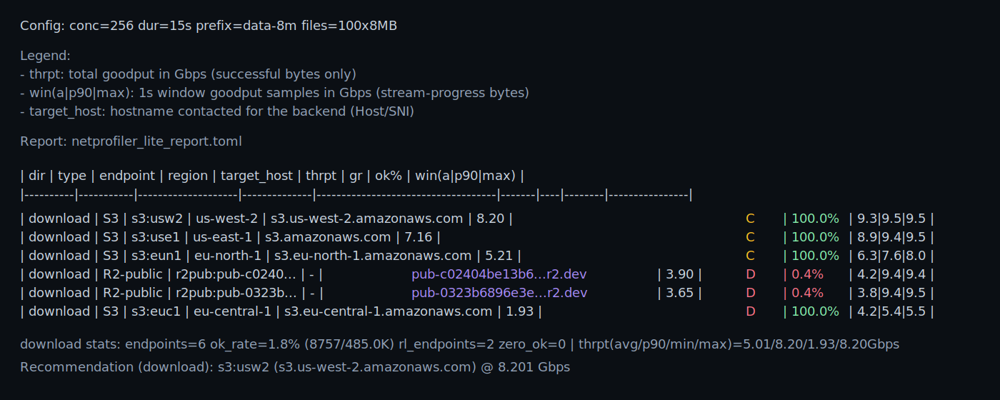

# netprofiler_lite

Small, shareable object-storage throughput benchmark.

- End-user download runs require no credentials (public-readable objects only).
- Defaults (object sizing + grading thresholds) are informed by field experience and conversations with HPC/AI researchers.
- Roadmap: evolve toward saturating an entire cluster (not just one host).

## Table of Contents

- [Quickstart](#quickstart)
- [Docs](#docs)
  - [`docs/nix.md`](docs/nix.md)
  - [`docs/usage.md`](docs/usage.md)
  - [`docs/preseed.md`](docs/preseed.md)
  - [`docs/release.md`](docs/release.md)

## Quickstart

Prebuilt binary (fastest):

```bash
version="$(curl -fsSL https://api.github.com/repos/kennethdsheridan/netprofiler_lite/releases/latest | sed -n 's/.*"tag_name": "v\([^"]*\)".*/\1/p')"
test -n "$version" || { echo "failed to detect latest version"; exit 1; }

os="$(uname -s)"; arch="$(uname -m)"
case "${os}-${arch}" in
  Linux-x86_64) asset="netprofiler_lite-${version}-x86_64-unknown-linux-musl.tar.gz" ;;
  Darwin-x86_64) asset="netprofiler_lite-${version}-x86_64-apple-darwin.tar.gz" ;;
  Darwin-arm64) asset="netprofiler_lite-${version}-aarch64-apple-darwin.tar.gz" ;;
  *) echo "unsupported: ${os}-${arch}"; exit 1 ;;
esac

base="https://github.com/kennethdsheridan/netprofiler_lite/releases/latest/download"
curl -fsSL -O "${base}/${asset}" -O "${base}/${asset}.sha256" || {
  # Backward-compat: older releases used a glibc-linked linux artifact name.
  if [ "${os}-${arch}" = "Linux-x86_64" ]; then
    asset="netprofiler_lite-${version}-x86_64-unknown-linux-gnu.tar.gz"
    curl -fsSL -O "${base}/${asset}" -O "${base}/${asset}.sha256"
  else
    exit 1
  fi
}
shasum -a 256 -c "${asset}.sha256" 2>/dev/null || sha256sum -c "${asset}.sha256"
tar -xzf "${asset}"

sudo install -m 0755 ./netprofiler_lite /usr/local/bin/netprofiler_lite

netprofiler_lite
```

Default endpoints (copy/paste; optional):

```bash
netprofiler_lite \
  --backends "sf-netprofiler-lite-public-6f9c2e-eun1:eu-north-1,sf-netprofiler-lite-public-6f9c2e-euc1:eu-central-1,sf-netprofiler-lite-public-6f9c2e-usw2:us-west-2,sf-netprofiler-lite-public-6f9c2e-use1:us-east-1,https://pub-0323b6896e3e42cb8971495d2f9a2370.r2.dev,https://pub-c02404be13b644a1874a29231dfbe0d2.r2.dev"
```

Note: running `netprofiler_lite` with no flags already uses the default endpoints.

Note on public R2: Cloudflare public R2 origins may throttle (HTTP 429). When that happens,
the tool will show a low `ok%` for those endpoints and the effective sample size (successful
requests) will be smaller.

Nix:

Getting started with Nix: [docs/nix.md](docs/nix.md)

```bash
nix run --accept-flake-config .#bench
```

Non-Nix (Rust toolchain):

```bash
curl https://sh.rustup.rs -sSf | sh -s -- -y
source "$HOME/.cargo/env"

cargo build --release
./target/release/netprofiler_lite
```

## Example Output



## Docs

- Table of contents:
- Nix setup: [docs/nix.md](docs/nix.md)
- Usage (CLI flags, config, backends, credentials, troubleshooting): [docs/usage.md](docs/usage.md)
- Preseeding objects (maintainers): [docs/preseed.md](docs/preseed.md)
- Releases (download + tag-based releases): [docs/release.md](docs/release.md)
